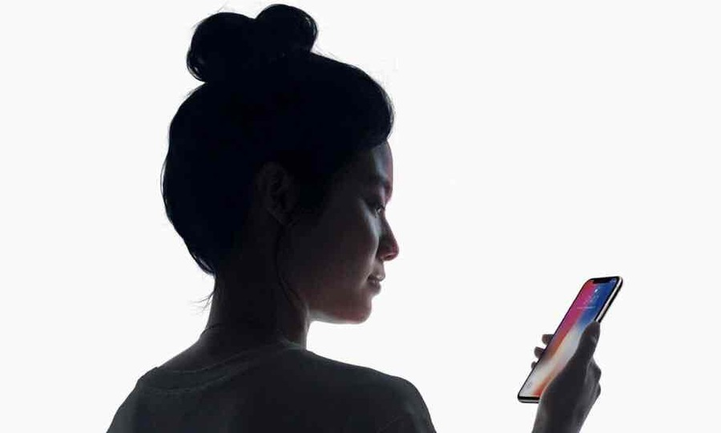
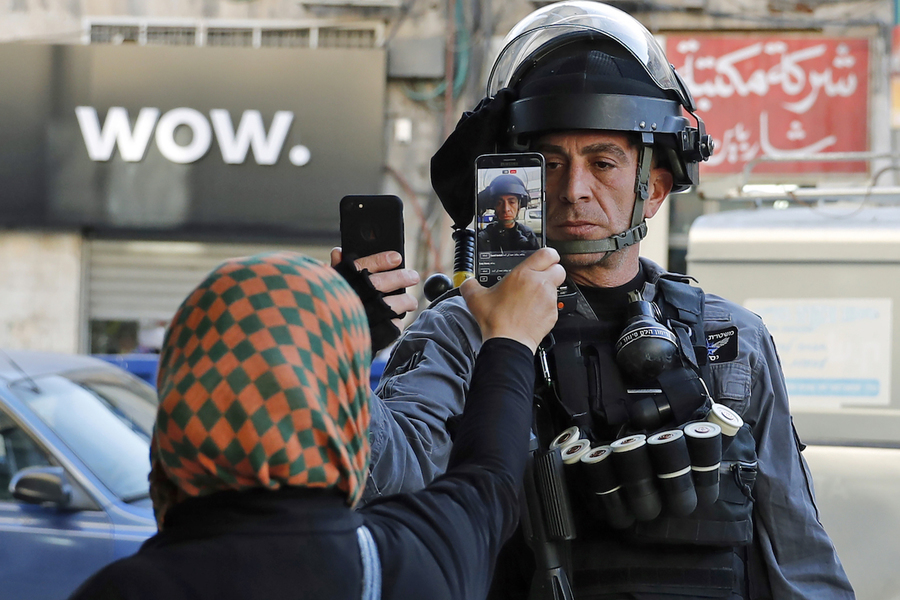
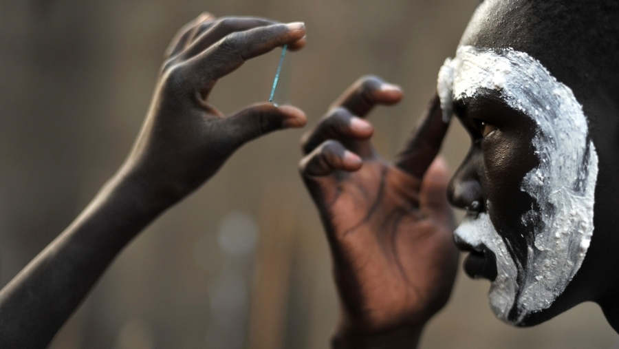
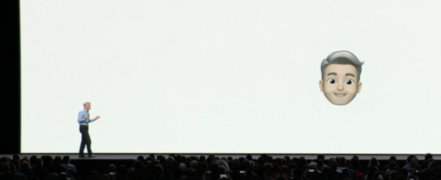
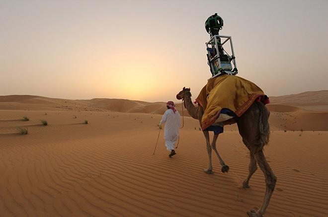
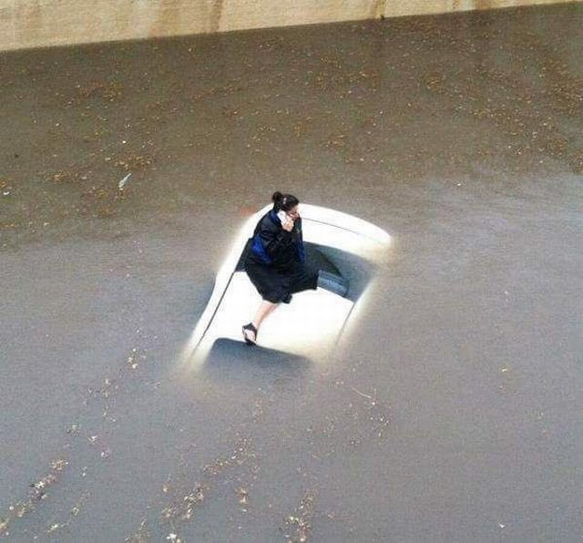

Six years ago, Jaden Smith tweeted a question that was quickly lampooned across the net. His tweet oozed both the banality of any New Age aphorism and the stupidity of a stoner’s observation of their weed-warped world, or so a lot of folks thought. In many respects he’s ahead of his time, and this observation in particular is one that strikes me as being a sleeper concept of sorts — “How can mirrors be real if our eyes aren’t real?”

I think a lot about this tweet in the context of contemporary interface design, as in the planning and assembly of digital systems a person can touch and see and hear.

These days, the mirrors we most often use to check our makeup or see if there’s gunk in our teeth are found on our phones — “smart” devices that coordinate an array of sensors and cutting-edge “image display” and “image capture” technologies to render reality within the boundaries of a powered physical display.

What’s interesting about smart-devices-as-mirrors is that the eventual representation of the “image of the world” is explicitly and wholly a “model” of the world — a “model” meaning a “ human-constructed representation (abstraction) of something that exists in reality”. Physical mirrors are interesting because they have the ability to render reality and even warp it, but what they depict is “a physical reality” in the truest sense; The physical qualities of a mirror can be seen as seeing the world through air, or seeing the world through water. While a human being can physically manipulate a physical mirror to alter the final reflection, the reflection in and of itself is a product of the physical world and unalterable in totality.

To a degree, film photography was an extension of this physical realization (rendering) of reality. At a certain point, what else is the capture of light on paper but a wholly physical process? While people intervened in the path of light’s travel with lenses and apertures and specifically-designed crystal-studded paper, what emerges as a process is less a constructed model of reality and more a continually warped representation of what actually exists in the world. Film and paper photography was a deeply labor-intensive art, full of cutting and cropping and poisoning and brushwork, all serving the act of rendering what was once a beam of light into an image-rendering of a particular summer day. Impressionism lives on in this sense.

It wasn’t until recently that most photographs became literal abstractions or literal models of thought with the advent of digital photographic capture. While the earliest digital photographs presented terrible image quality/resolution, they were possibly the most honest representations of what they actually were: a product of humans manipulating bits through clever mathematic compression to render blocks of color accordingly.

“How can mirrors be real if our eyes aren’t real?”

What we “see” in our screens is wholly a model of reality, wholly an abstraction of the natural world, wholly determined and manufactured by people sitting in an office in California somewhere, typing away at an IDE. When we strip away the image rendered on a screen, when we deconstruct an algorithm, what’s left?

What does it mean when most models (abstractions) of our digital representations are constructed in California, or completely in America for that matter?

When I look at myself on my phone camera, why do I get the haunting feeling I’m not situated in New York anymore? When I scroll through all the photos of friends and strangers on Facebook or Twitter, why does it all feel so flat? When I tap through my friend’s stories on Instagram and get interrupted by an ad for shoes, why does the shoe ad feel more real than the stories it’s sandwiched between?

*Stories*

In July of 2016, Kevin Systrom (the CEO of Instagram) unveiled the latest feature set to the eponymous app — Stories. He had a particularly interesting take on their most recent product feature, revealed in an interview with The Verge:

> Kevin Systrom, Instagram’s co-founder and CEO, credits Snapchat for developing the stories format. But he says it was always bound to surface in other apps. “My thesis is a story is a slideshow format,” Systrom said in an interview with The Verge. “Just like when Facebook invented the News Feed, and every social product was like, ‘That’s an innovation, how do we adapt that to our network?’ You’re going to see stories pop up in other networks over time, because it’s one of the best ways to show visual information in chronological order.”

When I think of formats, I most often think of the formats I encountered in my youth: Micro-cassettes, CD-Rs, DVDs, 3.5 inch floppy disks, even. In an expanded sense thanks to schooling and self-education I now nurture the impression that ISO-standard self-tapping screws are a certain format, sizes of wood slats are formats, the standard red brick is a format that building-forms find themselves expressed through. It’s interesting to think of “interfaces” as adopting something one would call a format, or becoming formats themselves.

The physical world is constructed from a vast number of standards that make things as simple as bricks possible. Likewise, digital interfaces are constructed through a vast number of technologies most people will never (and some argue, should) think about.

For that matter, most digital interface designers will never consider how the buttons they specify on-screen are handled by TCP/IP or the thousands of heavy metal physical servers that populate buttons they specify and “style” once in CSS.

When I paint I take a handheld tool, daub it with a mark-making material, and apply it to surface. This set of actions embodies what's known as the format of "painting". The word “Hello” is a world unto its linguistic self when displayed on a webpage. Similarly, the technology that made our digital-text “Hello” possible is vast beyond belief. Is the world a format?

*New American Interfaces*

When we talk about “New American Interfaces”, it’s important to expand upon the meaning of each word for a complete sense of the conceptual picture we’re trying to paint.

We should imagine “New American Interfaces” to be less a definition, more an expansion. Less an encircling and more an [arrangement collage](https://www.are.na/block/736425) of existing realities.

“New”ness is a direct reference to developments in human technology that span the last 10 years or so. “New” American technology does not refer to technology that was developed in the 1970s. “New” American Technology is not a reference to networking protocols or personal computers proliferating in the 90s. “Newness” refers to mobile phones finding themselves in billions of people’s hands and pockets. “Newness” refers to the viability of video streaming over wireless networks. “New” implies cameras directly imbued with the capability to re-model reality and assign social value through “the arrangement of certain interfaces” only found in the most cutting-edge devices. “New”ness implies the forgetting of the massive stacks of technology that exist to show us images of our friends and their lives in chronological order.

“America” speaks to the “Americanness” of the current world. Totalizing global governance, military might, far-reaching memetic saturation the rest of the world cannot escape from. “America” means pop culture, “America” means world police. “America” retains the ability to wobble the economy of the world when executives shitpost on Twitter. When we talk about “America”, we mean the hegemonic cultural-economic infrastructure the rest of the world rests upon whether they like it or not.

“Interfaces” speak to not any button, slider, or like button physical or digital or otherwise. “Interfaces” in the sense of “New American” interfaces refer to what Kevin Systrom meant when he called Snapchat a “format”. A replicable stack(s) of technology is an “interface”. An “interface” under this definition means every chat application is fundamentally the same and completely interchangeable. Linear conversation will always be linear conversation, and the pattern of linear conversation is what we call a messaging app, and we call this an “interface”. Every search interface is the same, every index is the same, every captive portal is the same. To take our example to the physical world, imagine this scene:

You see two chairs side by side with one another. From afar, they are completely the same. You inspect them close and they are the same, you notice they both are built from the same beautiful ash wood, every single detail is perfectly mirrored in both chairs.

One of these chairs was wholly made by human hands and the other was cut to shape by a machine, assembled by people on a factory line, and produced in the millions.

One of these chairs is an interface —

![A screenshot of a Kindle app screen. The highlighted text states 'We cannot be certain that photography is a position or the taking up of a position before the World, a decision of position towards the object or the motif. Before the eye, the hand, the torso are implicated in it, perhaps it is from the most obscure and the most irreflex- ive depth of the body that the photographic act departs. Not from the organ-body or body as organ-support, from the substance- body, but from a body absolutely without organs, from a stance rather than a position.'. A second tract of highlighted text states: ''Stance' - this word means: to be rooted in oneself, to be held within one's own immanence, to be at one's station rather than in a position rela- tive to the 'motif'. If there is a photographic thinking, it is first and foremost of the order of a test of one's naive self rather than of the decision, of auto-impression rather than of expression, of the self-inherence of the body rather than of being-in-the-World. A thinking that is rooted in rather than upon a corporeal base. What is the body as photographic base, stripped of intentionality? It is that which concentrates in itself an undivided and...](../../assets/190124/11.png)
