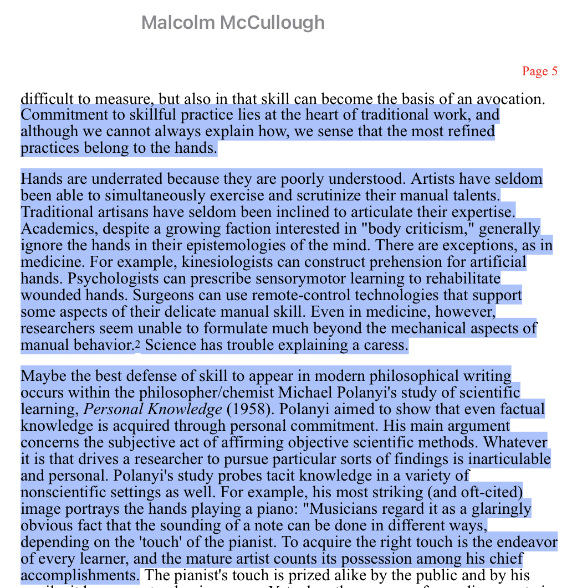
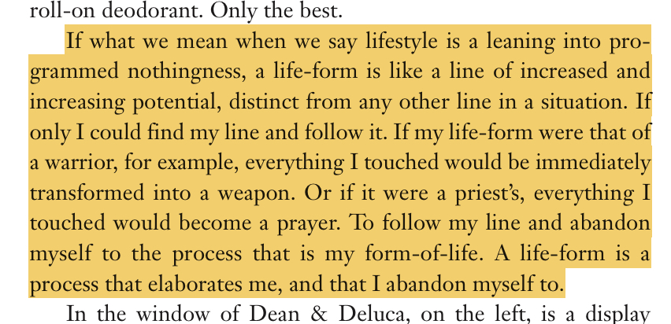
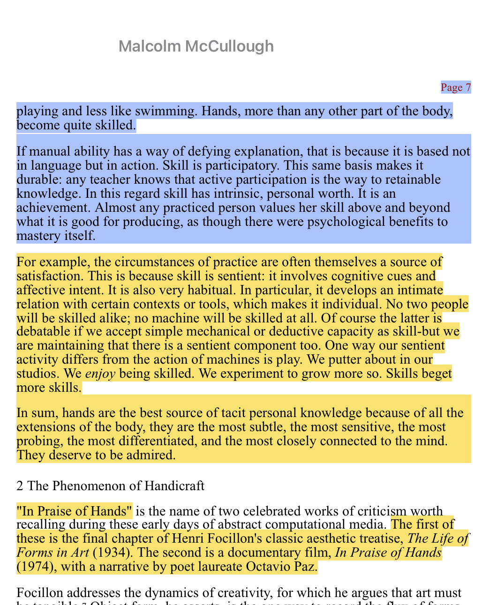
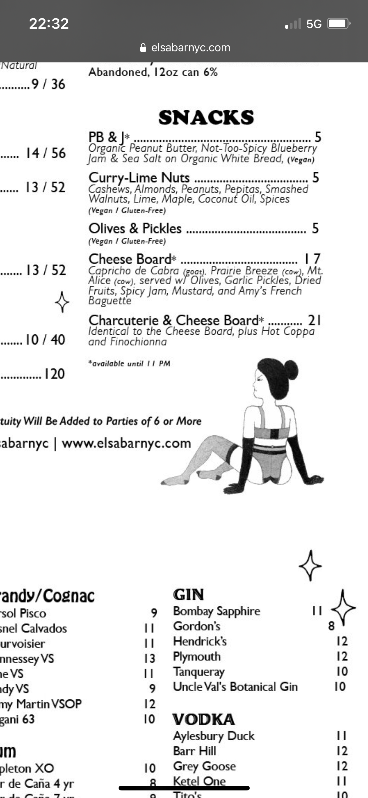
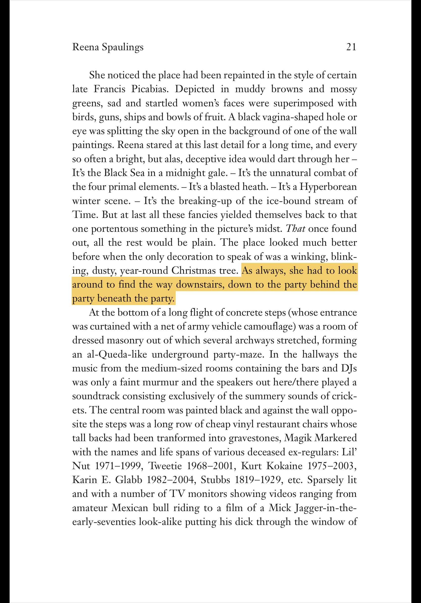
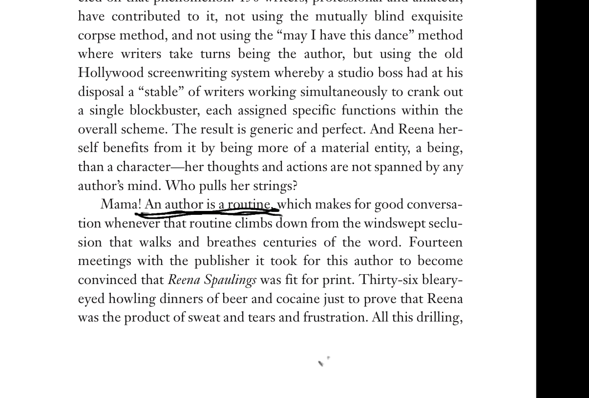
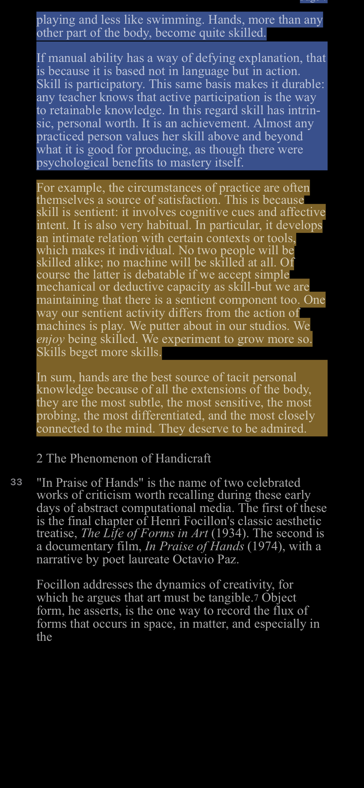

This week I’m focused on some extended QA for some work we’re putting out soon.

QA means “Quality Assurance” in this biz.

QA is derived from a variety of practices that stem from the middle ages apparently, which have in recent times been consolidated into the ISO 9000 family of standardized + auditable practices an organization can take on to streamline its processes. According to the Wikipedia entry linked, the ISO 9000 series are based on seven quality management principles (QMP):

1. QMP 1 – Customer focus
2. QMP 2 – Leadership
3. QMP 3 – Engagement of people
4. QMP 4 – Process approach
5. QMP 5 – Improvement
6. QMP 6 – Evidence-based decision making
7. QMP 7 – Relationship management

While Tlon has yet to adopt the ISO 9000 standard of QA, I will note that of the seven principles listed above, it might be apt to describe my own focus in terms of QMP IV and QMP V:

4. Process Approach: A desired result is achieved more efficiently when activities and related resources are managed as a process.
5. Improvement: Improvement of the organization's overall performance should be a permanent objective of the organization.

Historical QA is interesting, I highly recommend looking into it.

In the last week I’ve been reading a little more than I have been in the previous weeks. I’ve started a handful of books and have managed to complete one or two. I’ve been watching some interesting things too. Have you heard of Love Island (UK)? Have you heard of the various K-Dramas out there? Do you know what Reena looks like? Are you aware of the ideological patchwork that comprised the samizdat of the early American revolution?

It’s not that interesting, but here are select moments from some media over the last few weeks.

If you’re interested in what I’m interested in, you might find the above interesting.

An idea I’ve been meaning to expand upon for several weeks now is this conceit that designing digital interfaces, or software more broadly, is more like designing organs, prosthetics, or body parts, than it is designing “spaces” or "architecture".

This isn’t a new idea, far from it actually: McLuhan is a well-trod reference point here in his expansions that media–mediums are artificially-constructed means to extend one’s sight, cognition, or social standing in the global village.

My contribution to this realm of thinking doesn’t altogether build upon McLuhan’s core theory, but I find in my own day-to-day work, the problem of constructing a new body for people to explore new digital worlds is constantly top of mind.

One thing I’ve been meaning to particularly expand upon is the idea that a body’s capability is generally illegible from a distance: One can’t really determine whether someone is a professional dancer or trained fighter by simply looking at another's body. Sure, broad conceptions of out-of-shape-ness or in-shapeness might hold to be coarsely true, and one can guess at another's ability to climb a steep rock face by observing for a moment, but at the end of the day, a body's capability is essentially a shrouded thing. Some of the most peak-athletic individuals I know are missing limbs or are “disabled" in some form or another, so again, to reiterate: You really can't get a sense of what a body is capable of from a mere glance. This is fundamentally true.

Along a similar river of thought, one can’t typically gaze upon an interface and determine how it’s intended to be used, or what type of data it can/will/should contain.

Try as one might, there really is no strictly-defined “interface reason” I can’t upload a 3D model to Twitter, and yet I’m mysteriously barred from doing so.

Is there an interface that exists to suggest I can append a 3D model to the Twitter timeline? Without the ability to directly manipulate or interact with a given digital interface, there’s really no way to tell what the thing does at the end of the day.

What text can I highlight? What text can I click? What shapes can I tap? What data can I send to and fro? What connects to what, and to who? Do police use this website? Are people breaking the law on this app?

In at least one respect, a digital interface is like a body in the sense that it’s truly illegible at a distance. In many respects, very few interfaces are designed to be used “at a distance”, to begin with. There are a lot of spots in this comparison, but in my daily idling it feels like an essentially-correct stance.

I’ll write more about this later
