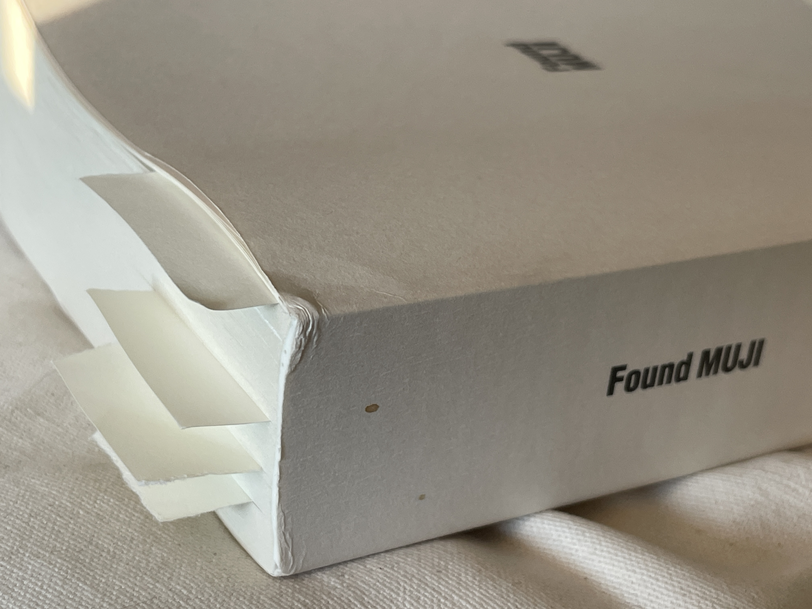
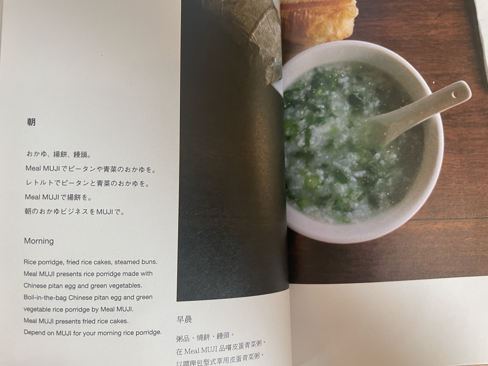
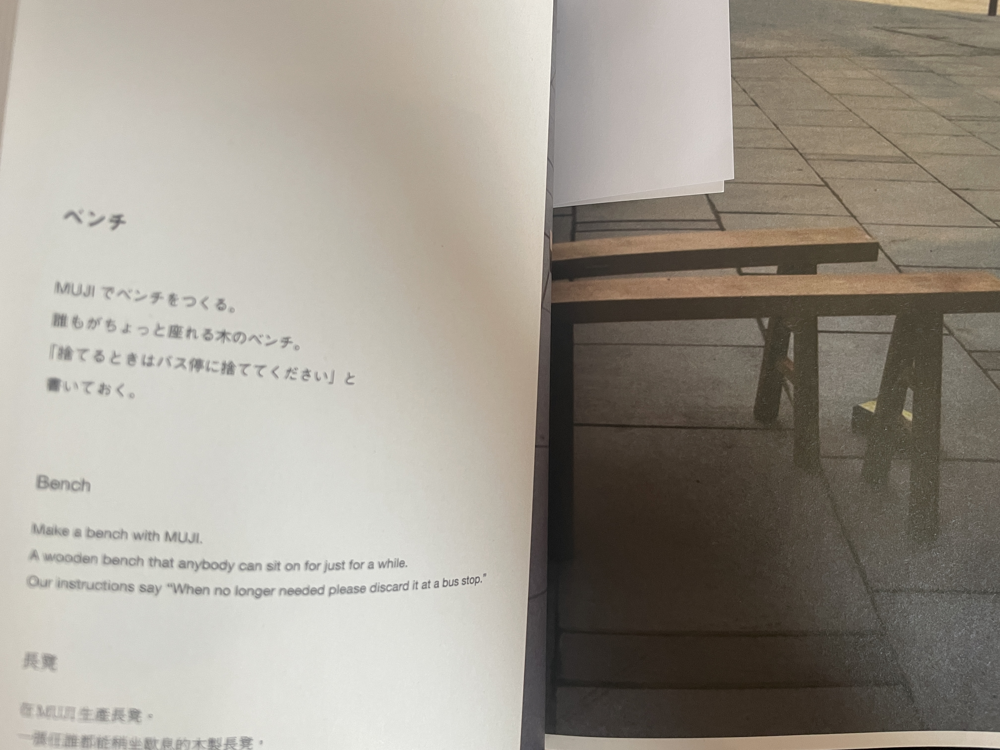
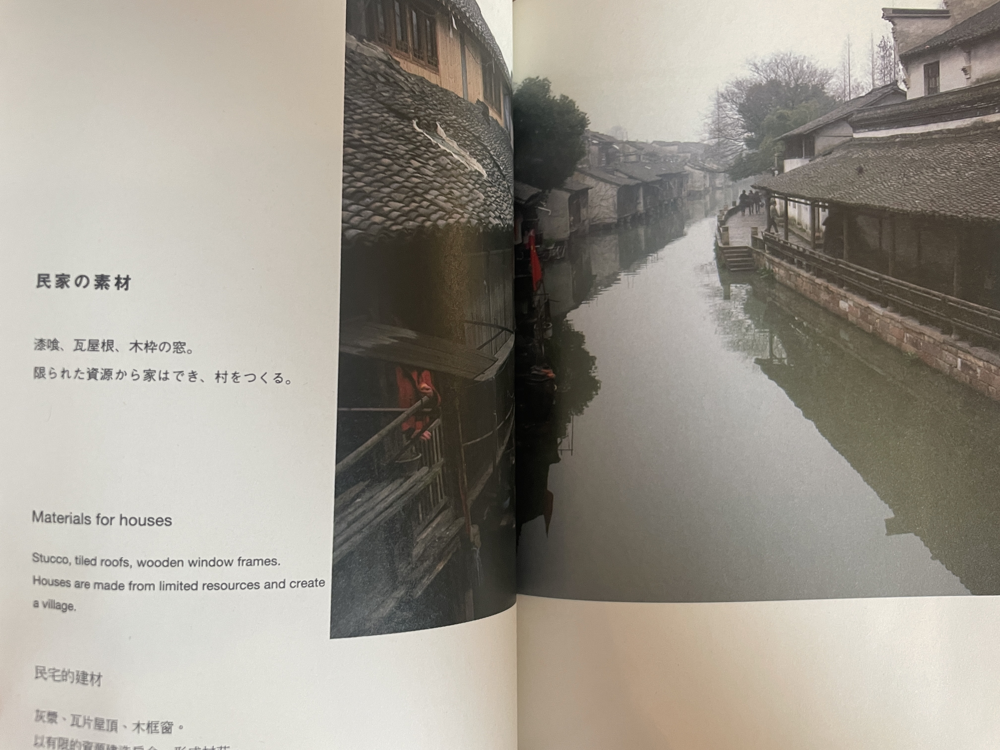
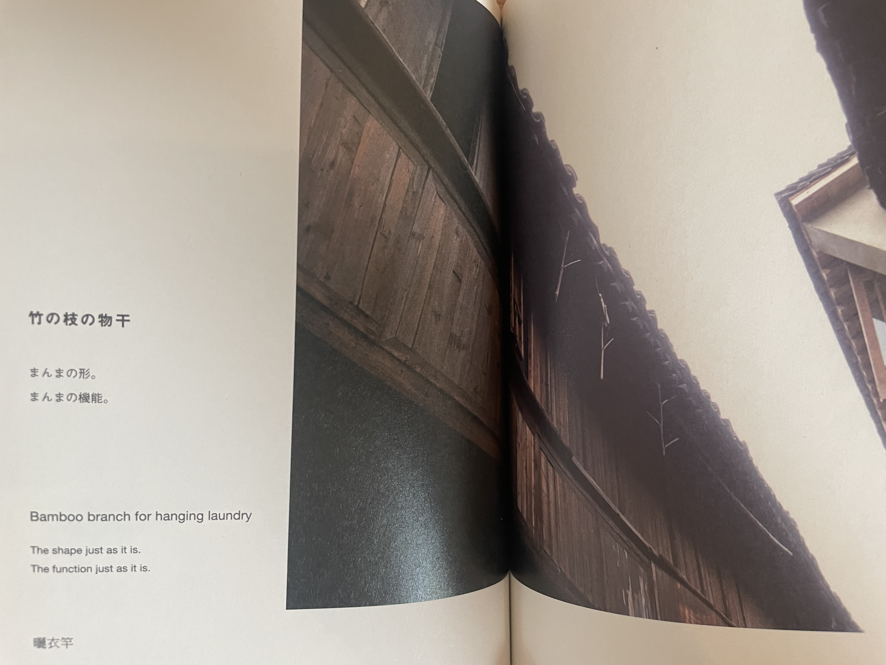

Found MUJI is a 458-page photo essay published and edited by Muji in 2012. Naoto Fukasawa, a longtime Muji collaborator and well-known industrial designer, appears in the book’s imprint as the art director and principal photographer, among several other photographers.

The book is a subtly beautiful object: Soft off-white paper bound up in a french fold style, unpretentious printing of both photography and text. Structurally, the book is divided into four sections or chapters, each demarcating the countries China, France, Thailand, and India. China’s chapter takes up around half of Found MUJI’s total length, while the remaining countries are split evenly across the remaining pages.

Listed within each chapter are objects, scenes, and people that appear to embody the subtle values found embedded in Muji’s own products. The book’s opening statements clearly outline the intent of the book and cast a light on Muji’s design process (emphasis mine):

> Rather than just making things, MUJI has always taken the stance of "searching and finding" a lifestyle. We search throughout the world for items that have long been used in daily life without ever going out of fashion, improve on them a little to fit changing lifestyles, culture and customs and reproduce them at a reasonable price.
>
> From 2003 we named these activities "Found MUJ!" and we began to make further journeys, getting into the fine details of the world and seeking out good products. Among the things that we find, there are some that are difficult to assimilate into our lives if the quality is left just as it is. To match the quality standards for our present lives, we interact with the creator of these items and modify, improve and re-tailor them as MUJI. Refining our search skills to spot something good, we retain the essence of that item and make it even better by matching it to our present lifestyle.
>
> The starting point for these Found MUJI activities originated right here in Aoyama on November 11, 2011. This book is a record of the travels of Found MUJI. The actual moments and places encounters with things or lifestyles take place and the thoughts that occur at those times are put into words and are accompanied by photographs. With the backdrop of current trends and the tendency for people to be attracted by new things, we have captured the moments we found true values that had become buried or difficult to see.

Immediately, unique aspects of Muji’s design methodology begin to unfold before the reader, namely the notion that’s Muji’s own products emanate from observation — from seeking out the ubiquitous, essentially quotidian rituals and objects in people’s lives, editing these objects, and reproducing them at reasonable prices.

Muji's production process, listed out in a straightforward manner:

1. MUJI Seeks
2. MUJI Observes
3. MUJI Edits
4. MUJI Streamlines
5. MUJI Mass Produces

\*

On a personal note, related to this text:

As we continue to emphasize the split concerns between the Urbit Foundation (the cultivation of a network-protocol, educating others on the use of said infrastructure) and Tlon Corporation (the production of beautiful, considerate, simple, and durable services and goods), actually considering the present moment in time, actually considering the current context of software product development, etc. is deeply important to the day-to-day design practice at Tlon.

Muji is an interesting case study as they embodied a distinct point of view at the height of Japan's economic bubble — that mass produced home goods don't need to exhibit ostentatious detailing, that products could be a breath of fresh air, not another thing to cram into a small apartment, that one could observe patterns existing in the world and heighten them, etc.

\*

At the present time, many of the nascent cultures around new internet technologies are ostentatious, loud, colorful, and quite in your face.

These are patterns smeared over technical works to grant the sense that “private key interfaces are fun and playful”, that “the blockchain is a place to play games”, that "wow, this new technology is hype!".

Exuberant product design makes sense in a world where people and (new) movements are exuberant, but exuberance is a cyclical aspect of people, markets, nature, etc. There is summer and winter in all things: Blockchain technologies will inevitably become boring and more or less “a given” in the world, and hype branding will feel stale quickly. The look and feel of most product out there already feels old-fashioned in my eyes.

Like, I don’t care what my database looks like, you understand? The thing about images is that they fade. Most products these days are sold as images, and will die as images.

\*

An idea underpinning our design work at Tlon is to build products and environments and services that “grant space” for a person to build their (digital) life out within. Most of the prominent organizations building interesting protocols out there don’t take the idea of “granting space” seriously, in my opinion.

A crucial aspect of a good that “grants space” is that it loses itself the moment it comes into contact with a person or a group of people. The moment a blank sketchbook is gifted to a gifted artist is the moment the sketchbook begins to lose itself to the expression of the artist. The moment a lattice is intertwined with a grape seed, it loses itself and eventually becomes hidden by the vine and leaf of the plant.

In a parallel manner to the production practices of Muji, who sought to observe and build upon people’s existing rituals/practices in their lives, and “expand” them to fit into more people’s lives, so we seek to extend generalized systems + patterns of prototypical social software and make them available for all people to easily compose and arrange, like one might arrange shelving in a shop, furniture in a home, plants in the garden, etc.

\*

Some of my favorite pages from Found MUJI, in no particular order:

