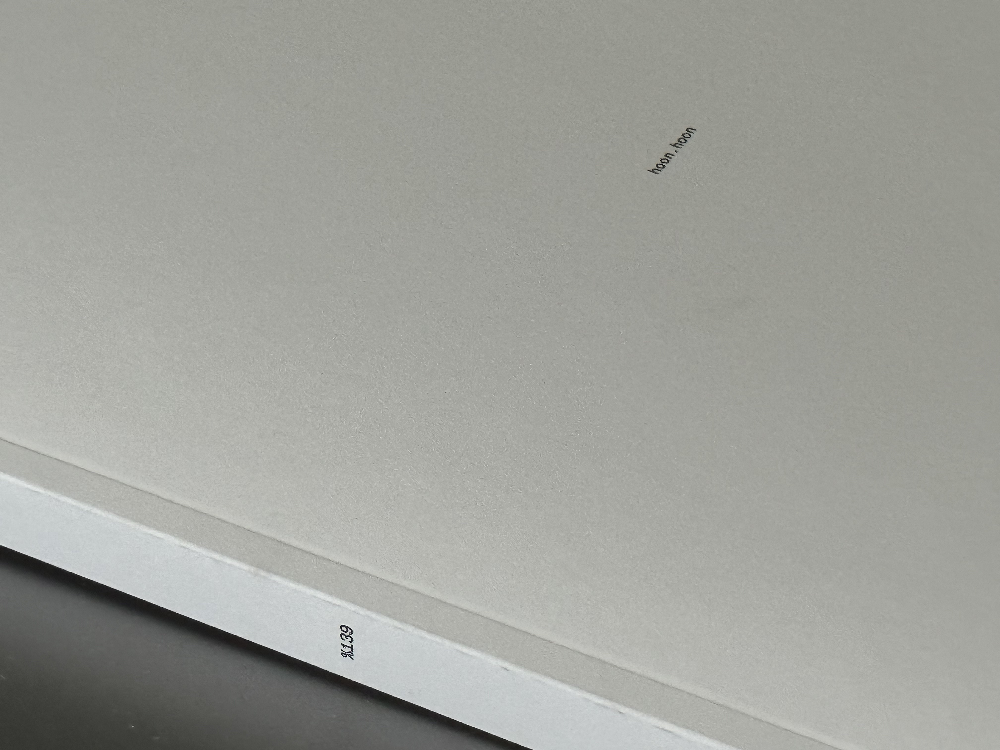
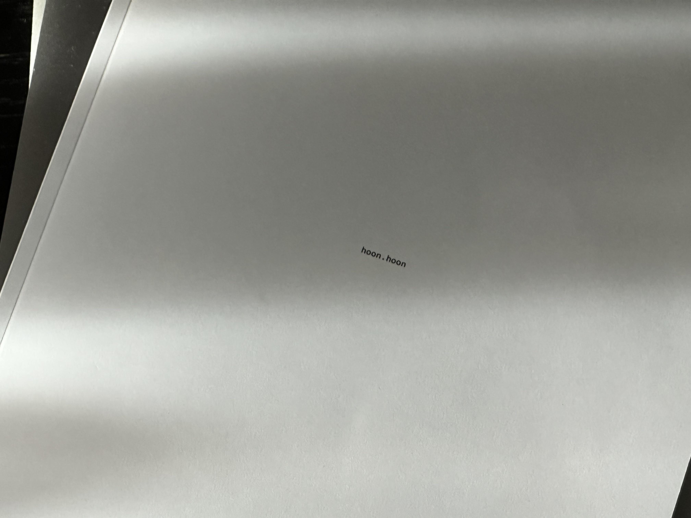
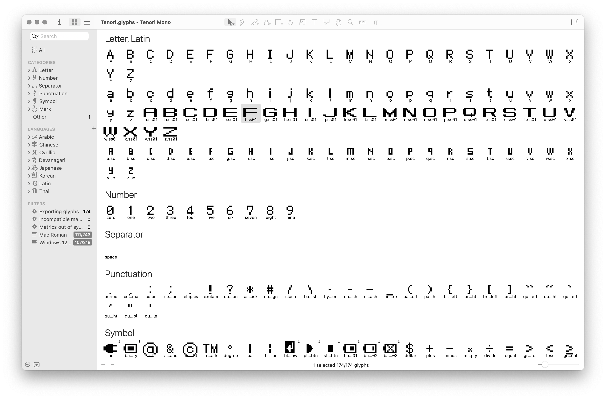

After thinking about it over the years, I believe if a genie were to grant me three wishes, I'd wish for the following:

1. Total linguistic-cultural-semiotic equivalence between the words “money” and “water”, across all human civilizations and societies.
2. Total linguistic-cultural-semiotic equivalence between the words “life” and “death”, across all human civilizations and societies.
3. Total/universal reset of all progress made in artistic development and practice, requiring total rediscovery of all artistic concepts.

This week Romina and I have been cooking up some great physical manifestations of our work at Tlon. I'll find ways to share the work out eventually.

I've recently finished drawing the first iteration of a pixel font clone this week. It's based off the three or so pixel fonts found in Yamaha's [Tenori-On](https://en.wikipedia.org/wiki/Yamaha_Tenori-on), a music-making device with an iconic grid of LEDs as the primary control surface.

While the majority of the clone is a 1:1 replica of the existing alphanumeric glyphs on the device, I extrapolated a few of the "small caps" and "display" fonts (which only included a few characters) into a full alphabet:

Notably missing from the glyphs on the machine are a "full" punctuation and math symbol set. My aim is to fill out the remaining glyphs needed for a "complete" pixel typeface, with full keyboard coverage.
