## Landscape Context & Evolution

Landscape is a container environment (an operating environment) for downloading, using, and navigating Urbit software. It's been evolving as a concept since 2015, well before [Dan](https://read.cv/dnbrwstr) or I worked at Tlon. The evolutionary arc of Landscape informed our latest updates to Landscape, as we’ll describe.

As an “environment”, Landscape can be loosely described as the embodiment of Tlon’s latest thinking on how digital products (or software in general, really) can be interacted with, made useful in one’s life, and developed—or hacked together—in a systematic manner. Landscape in its ideal form is like a piece of paper, a lattice, or a glass you’d put flowers in. We’re designing Landscape as an “empty vessel” you can fill with software, people, and information that’s actually meaningful to you.

Our vision for Landscape is for it to become an ideal next-generation personal computer.

This doc briefly outlines the evolution of Landscape:
- The theses that informed its initial design and overall “arc” of development,
- The more granular problems Landscape has been designed to address, and
- The decisions that led to its latest iteration as an environment for experiencing Urbit software.
- A rough look at our sketching and prototyping process, leading up to our current take on Landscape’s next iteration

Landscape brings to mind Tlon’s tendency to take workaday software forms that surround us and (ADDITIONAL CONTEXT HERE TBD) inject them with a little bit of magic. While this is an attitude and product sensibility we’ve been honing for over four years, it’s Landscape’s forthcoming release that begins to truly express what makes Urbit unique as a foundation for a new personal computer.

As a thesis, Landscape has taken on five distinct expressions since ~2015 or so:

A collection of TUI utilities like IRC and primitive email and a forum-like software available to the public, to anyone running an urbit as on-urbit utilities:

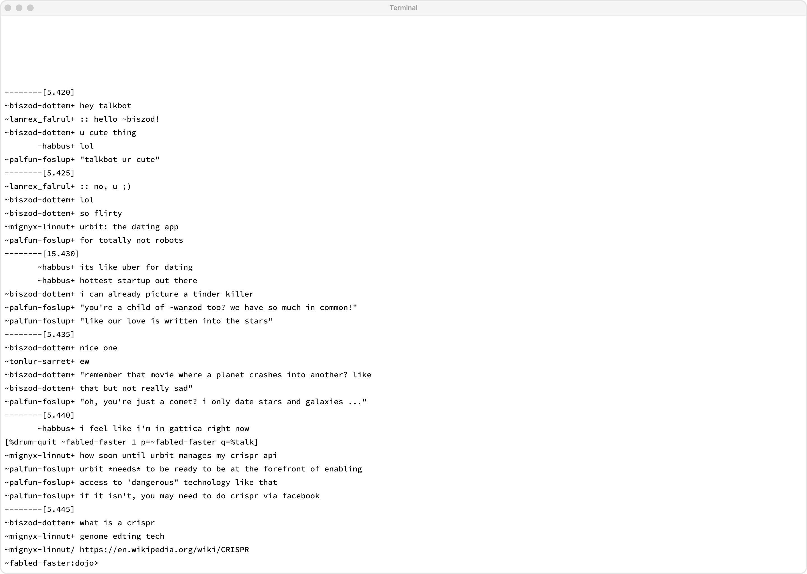

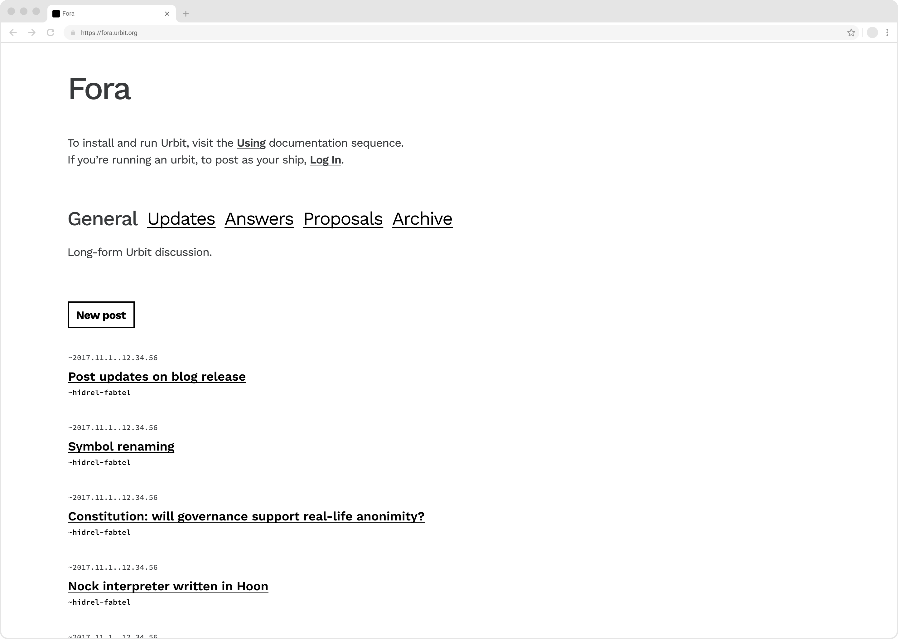

A series of web-based internal experiments (including a tiling window manager), and notably, the first public release of an OS-like interface code-named Modulo: An experimental “wrapper” environment for the various interface experiments:

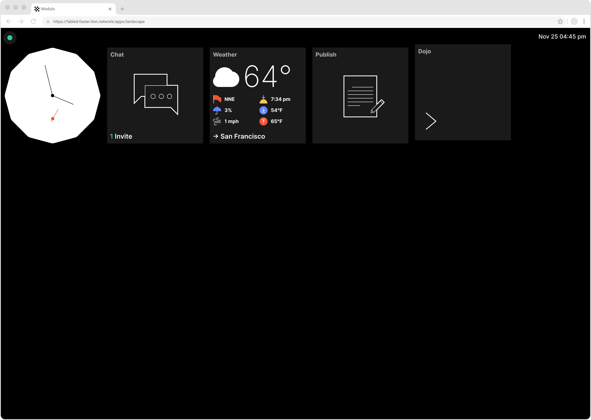

OS 1, a refinement on the above environment, with system affordances such as notifications, user profiles, a stricter boundary between tile-only widgets and more involved applications, and the first iteration of Groups, in which we started to explore what a “Community Operating System” could look like:

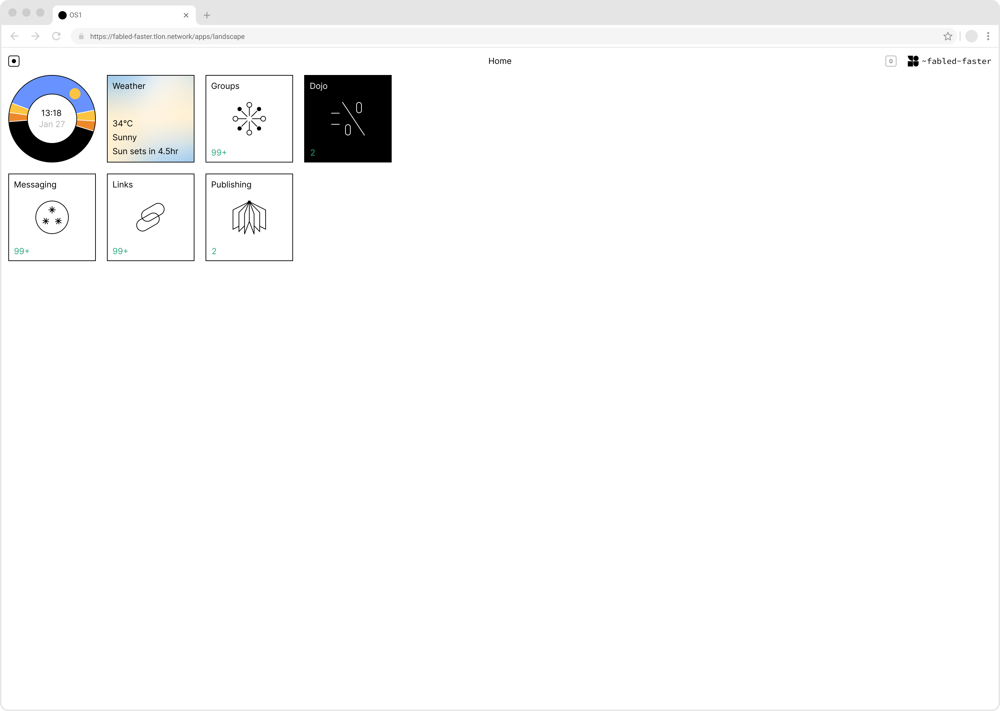

OS 2 represents an obvious evolution of OS 1, with the “Indigo” design language being formally established. The thesis of a community (or people-first) operating system is increasingly explored, with Groups taking the place of “App Tiles” you might expect to see in a classic operating system. I used to explain this vision as akin to an iPhone home screen with group chat tiles instead of app tiles. Further “system” interfaces such as Leap, version hashes, and developer mode are crystalized in the interface:

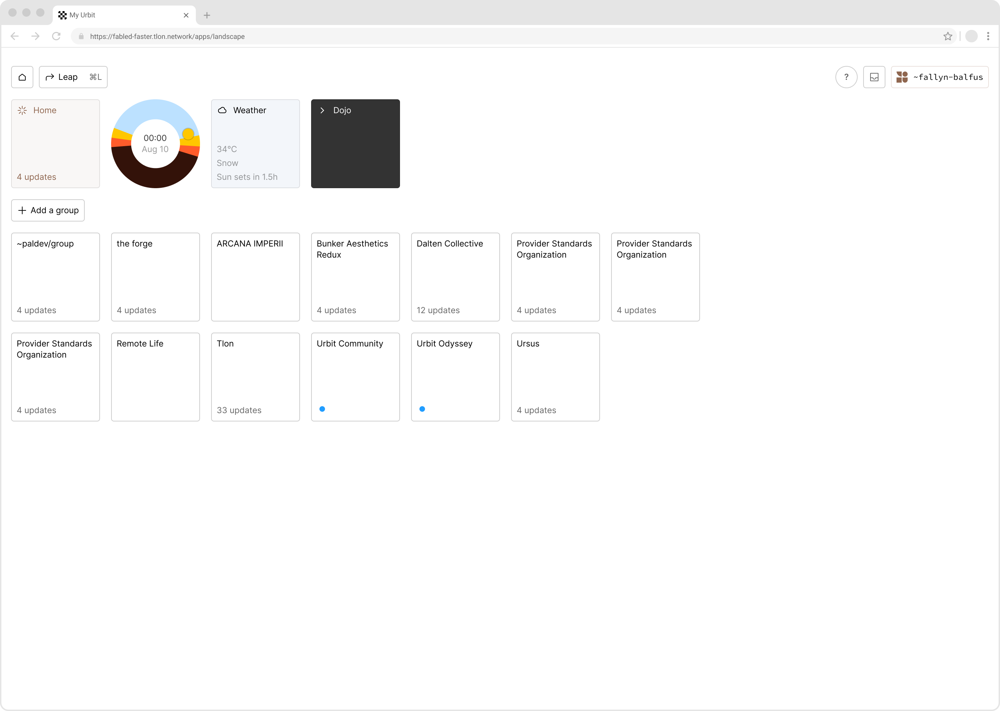

Landscape “Grid” is the final product of a combined Tlon/Urbit Foundation which resulted in an OS2 deconstructed into discrete “standalone applications” which lived in a Landscape interface dedicated to software distribution. In this new model for Landscape, app developers on Urbit had a concrete “target” for distributing their software using their own urbits as app-hosting repositories.

## Landscape’s Present State

In the sprint to accommodate third-party application development and ensure Landscape was “legible” as a “container” for Urbit apps, Tlon’s development team ended up deconstructing OS2.

This was achieved by splitting OS2 into two interface groups:
1. “System” interface, which would become Landscape “Grid” itself
2. “Standalone App” interfaces, which would become the Groups, Terminal, and the Bitcoin apps, and serve as the first model for how more modular software could be built using Landscape as its container

This deconstruction is roughly indicated in the sketch below.

Red + Green: OS2 elements that would be re-bundled as standalone apps

**Black**: OS2 elements that would be “elevated” into the vessel for standalone apps, called “Landscape”

Fully extracting these parts and clarifying their role in the new software ecosystem ended up being a series of communication and product strategy works we achieved in the year or so after Landscape “Grid”’s debut. After all was said and done, we ended up with Landscape staying more or less intact as a system interface, with its parts recontextualized in order to make the whole system legible as a “target” for app distribution. This initial state resulted in minor confusion for some in Landscape’s early user base: Why was the previous software form (OS2) now called Groups? Why can’t I view DMs anymore in Landscape — why do I need to access Groups to see DMs? These questions and more underlined the need for us to clarify the various parts of Landscape, and the software contained within.

Most of our product development effort since then was spent on the suite of standalone applications contained within Landscape, such as refining/upgrading/solidifying Groups, breaking out the channel “types” contained in Groups to “standalone app” status (Talk/Small Talk (DMs) being the first public example), and various internal evolutions to “connective tissue” features such as inter-app notifications.

Since first being demoed at Assembly ‘21, Landscape itself hasn’t dramatically evolved:

We’ve had a lot of time to reflect on how to update Landscape’s design so that it better facilitates the following use cases for everyday people …

1. Containing and displaying your urbit’s software
2. Acquiring and sharing new urbit software
3. Curating urbit software “in your network”
4. Navigating between urbit software, or using multiple apps at once

… and for Urbit developers alike …

1. Developing Urbit apps for Landscape
2. Distributing Urbit apps for Landscape
3. Hooking into Landscape’s various SDKs + APIs
4. Exposing additional surface area for your software to be useful for end users

… all while reflecting Tlon’s unique point of view on software utility, durability, and beauty.

## Core Landscape UX Updates

One of the primary issues with Landscape’s UX we immediately wanted to address was the problem of leaning on people’s web browsers to solve “window management” and “inter-app navigation” for us. This problem was felt most by people who desired to view multiple DMs alongside one another, or alongside other urbit apps, or ran into issues navigating “back” to Landscape.

Due to Landscape regressing as a “container” for software, we had no real app-spanning “system interface” that would work well or make sense when distributed across a browser’s tabs. Pressing a back button that leads “Back to Landscape” would simply open up a new tab with a duplicated instance of Landscape, due to the browser’s limitations with linking across contexts under a single domain.

We explored a few means of addressing this issue, and ended up leaning on a ubiquitous interface familiar to most people: The humble “tab”.

Important to us at Tlon is the principle to not misrepresent Urbit’s capabilities through hand-wavey interface design. While it may have been tempting to address “inter app navigation” and “(app) window management” through a desktop metaphor, we felt that embedding a pseudo-desktop in the context of a browser (or a standalone Landscape app for that matter) would misrepresent what an Urbit is to people. For most people using an urbit, self-hosted or otherwise, their primary access point is through the medium of a web browser (and soon, native mobile apps). Based on previous UI experiments conducted back in 2015–2017, we’ve known for a while that “true” window management is an incredibly difficult problem to solve in the context of the browser. With this prior knowledge and our principles in mind, we’ve designed an environment for urbit applications that feels simple, accessible, utility-oriented, and isn’t trying to pretend to be something it’s not.

A quick run-down of the core elements/mechanics of Landscape’s latest iteration:

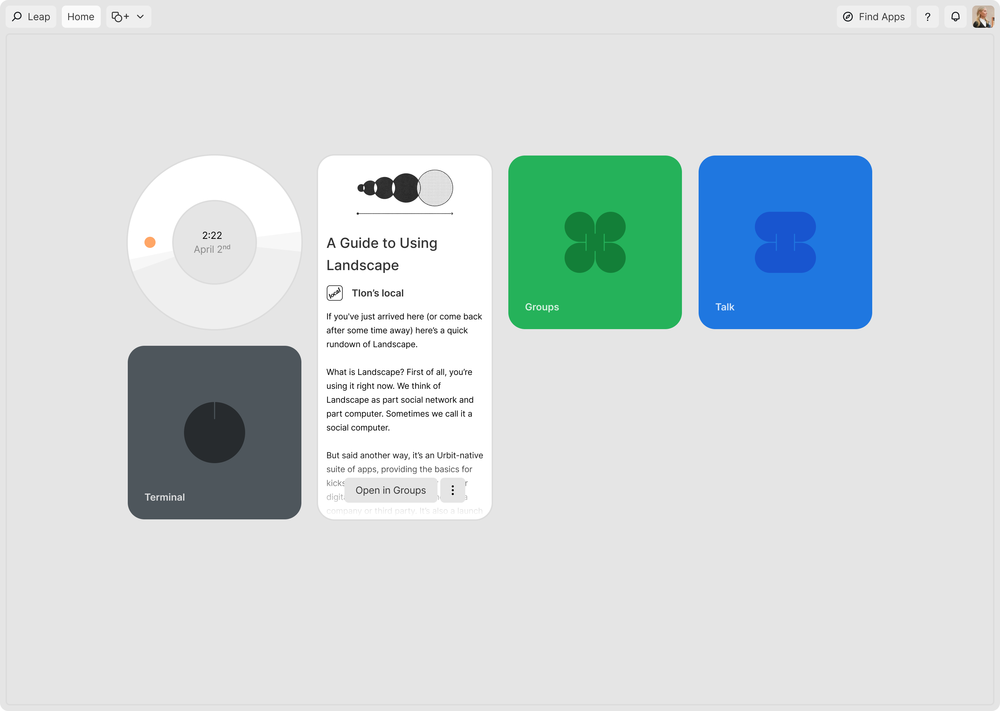

### App Tabs and Menu Bar

In Landscape’s next iteration, we’ll be situating “App Tabs” as the primary app view mechanism, mirroring how people already use web browsers to begin with. The screen above depicts the new “default” experience for new Landscape users, which is an App called “Widget Space” labeled “Home” by default.

Along with App Tabs: Leap, Notifications, App Discovery, User Profiles/Contacts, and Help/Support will be elevated to interfaces that can be accessed no matter what apps you have open, better grounding you within your urbit, and making “Landscape cross-app notifications” a lot more useful for people.

### Widgets and Widget Spaces

Widget spaces can be used to mirror Landscape’s current experience, in the form of “pinning” an app’s shortcut to the space. App-shortcut-pinning is a capability offered by default to developers of Landscape-compatible Urbit apps, but widget spaces can also grant developers the ability to expose dynamic “slices” or “fragments” or “chunks” of their existing apps. Above, the Notebook channel type from within Groups can be exposed on a widget space, providing users the ability to stay up to date with the latest post in a Notebook. The Clock widget seen above could be representative of a standalone “Clocks” app which grants users the ability to pin one or more of several styles of clock to their widget space “Home” app tab.

Important to note here is that apps downloaded to your urbit are no longer added to a large and inert grid as they are currently. New apps are added to a list accessible via the “New App Tab” button, or Leap. Users of Landscape can choose whether they want to pin shortcuts of their apps to their widget spaces.

### App Tab Splits (Arrangements)

Widget spaces are just one type of app that can be recombined with other existing apps such as Terminal, Groups, and Talk, in the form of “App Tab Splits”, which grant Landscape users the ability to arrange applications in a visually linear manner by “splitting” app tab space. This app arrangement style is a happy medium between full desktop metaphor and a simpler “linear” tabbing model found in most web browsers. App Tab Splits could be used to situate a timer alongside a blog entry interface, four DMs alongside one another, or two groups side-by-side.

### Customization

It goes without saying that we’ve kept Landscape a little on the bare side for a while. This will be changing with the latest updates to Landscape, and to the standalone apps within Landscape.

These core updates to Landscape’s navigation and app/environment management UX will serve as a foundation for exploring how urbit apps and their container environment can interoperate and relate with one another in more advanced/interesting/fun ways.

## Design Process

### Prior Art

We started off this sprint by taking stock of the history of Landscape (summarized above) and mapping important throughlines in each iteration:

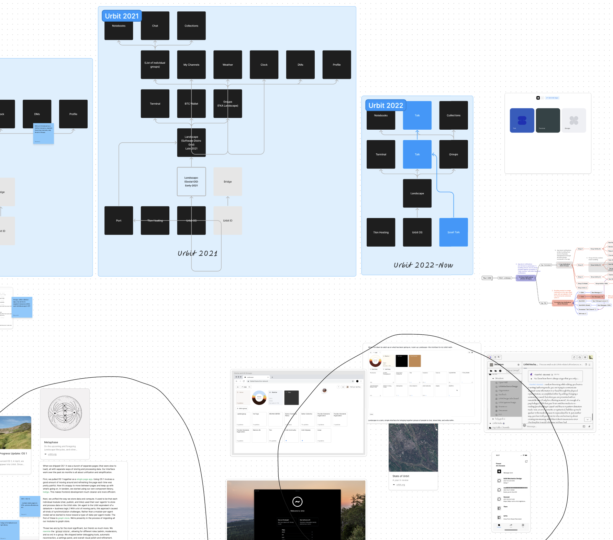

### Sketching

With Tlon’s prior art stated, observed, and taken stock of, we cross-correlated some of the major learnings from each iteration with UX update desires we’ve heard expressed from our community, corroborated by our own observations as people who’ve been embedded in this software for years at this point.

We sketched out a variety of possibilities, starting off with a few in-person “design drifts”, and continuing with higher-fidelity prototypes, mocks, and Figma sketches cobbled together from existing design systems we’ve implemented for our current suite of software.

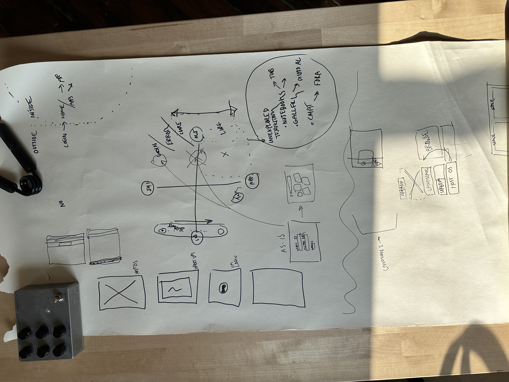

It was a relatively straightforward task to boil down some of the more obvious UX failures on Landscape’s part (such as lack of cross-app navigation for example) to several potential solution paths, such as providing injected “system ui” for all applications installed to your urbit, ever-present app tile HUDs, or simple tabs for apps themselves.

### Prototyping

In the end, the simpler approach won, and we set to prototyping a real interface to be distributed as an actual Urbit app: A “Prototype Landscape” distributed within Current-day Landscape as a “Landscape App”.

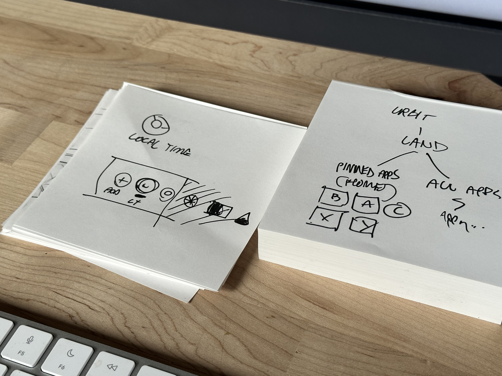

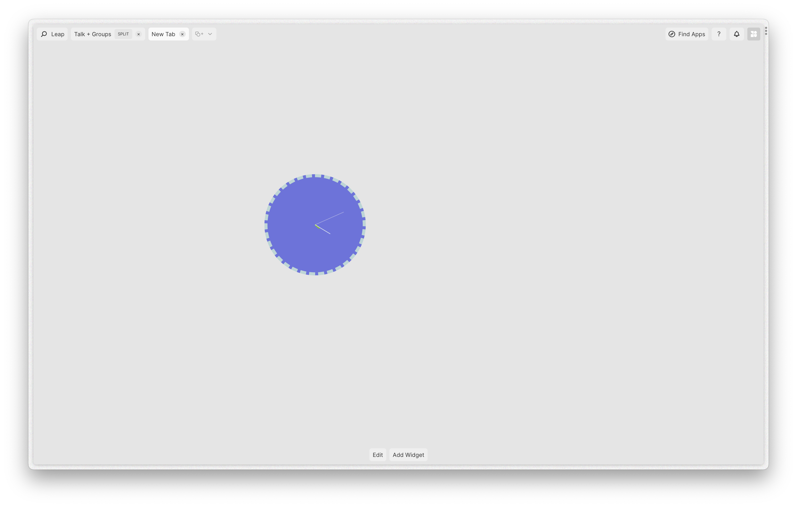

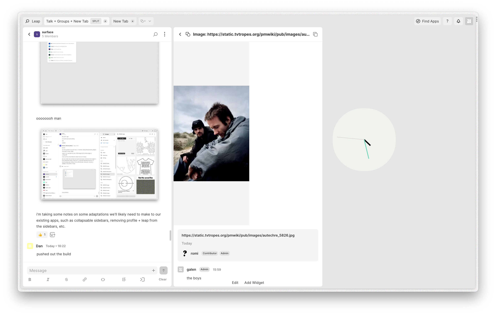

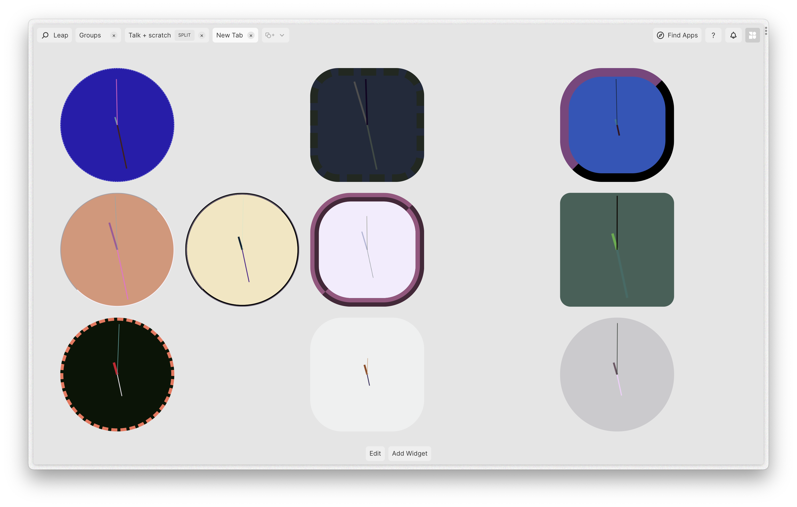

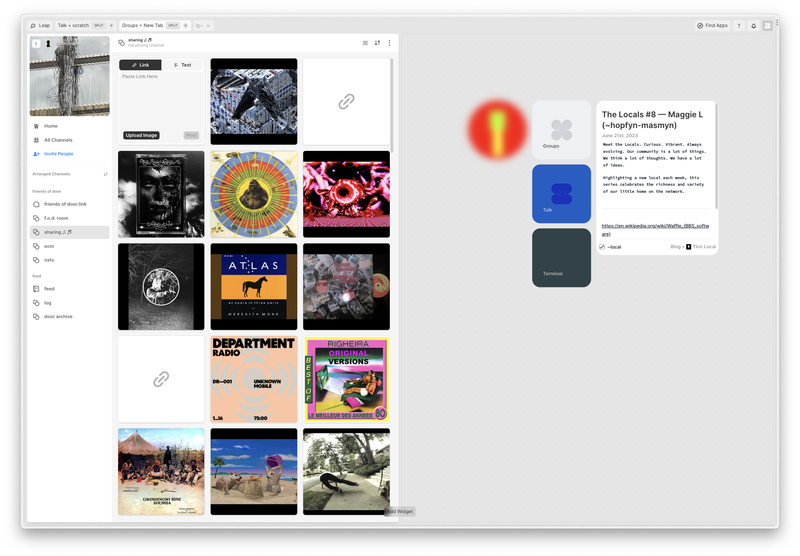

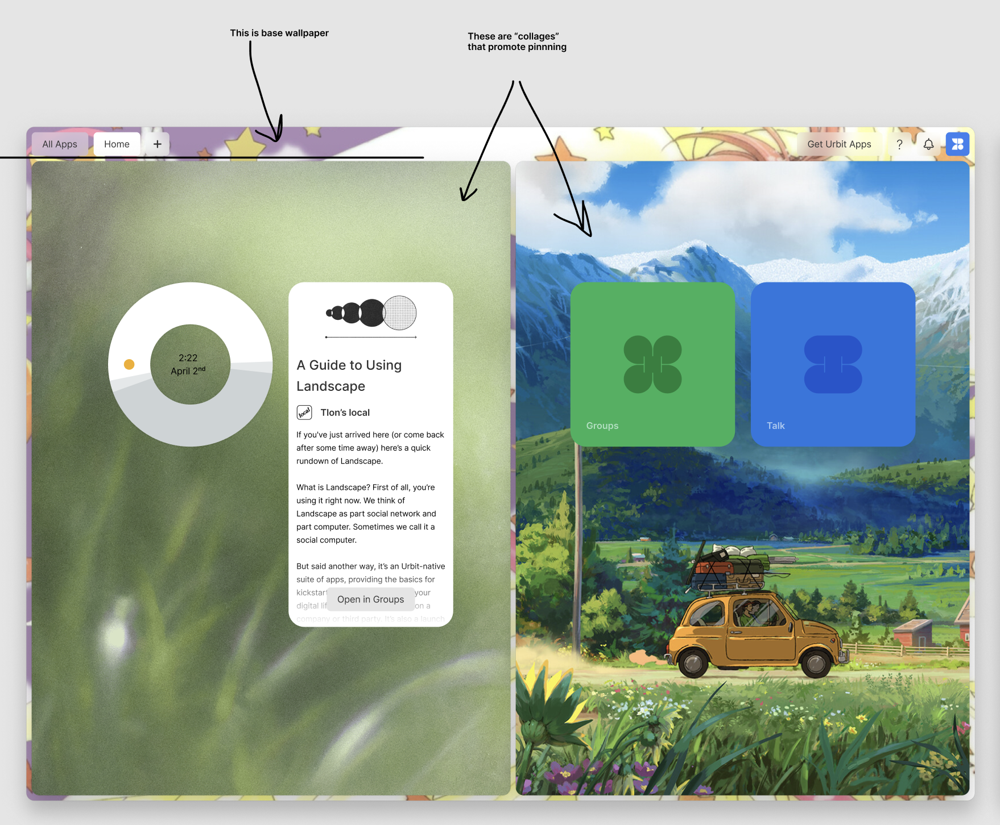

## Next Steps

As our prototype stands, it’s a relatively modest update from “Landscape: Grid”. We’ll be testing the efficacy of our work internally at Tlon and with folks interested in “early adopting” our work. A standard design process will follow by which we’ll collect usage data through programmatic and social means, and get a sense of how much further design and development effort is required to improve this vision of Landscape, and potentially ship it as a drop-in replacement for Landscape: Grid.

We hope to meaningfully evolve Landscape from its current state, a compromise of time, intent, and limited development resources, to an environment more representative of Tlon’s vision for what a new personal computer can be.

The core “App Tabbing” update mitigates a lot of the perceived ux issues associated with our standalone apps’ and Landscape’s lack of “interconnectivity”, and associated navigation issues. This new interface also manages to squeeze the previous interface,which took up an entire screen, into a menu bar. We anticipate that we’ll receive a lot of feedback about these changes, and will edit our designs accordingly if anything major is amiss or not received well.

App Widgets and Landscape “development experience” improvements are related areas for improvement. We have many ideas for how people can use these new affordances, and hope people are ready to experiment with what we have in store.
