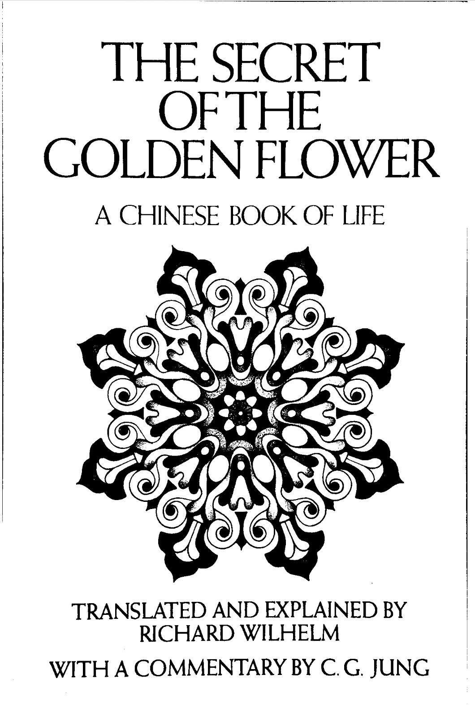
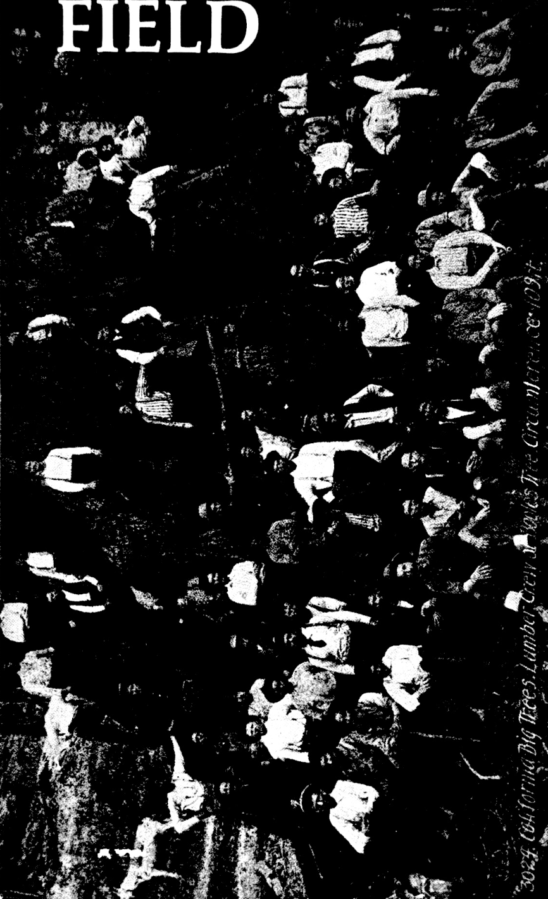
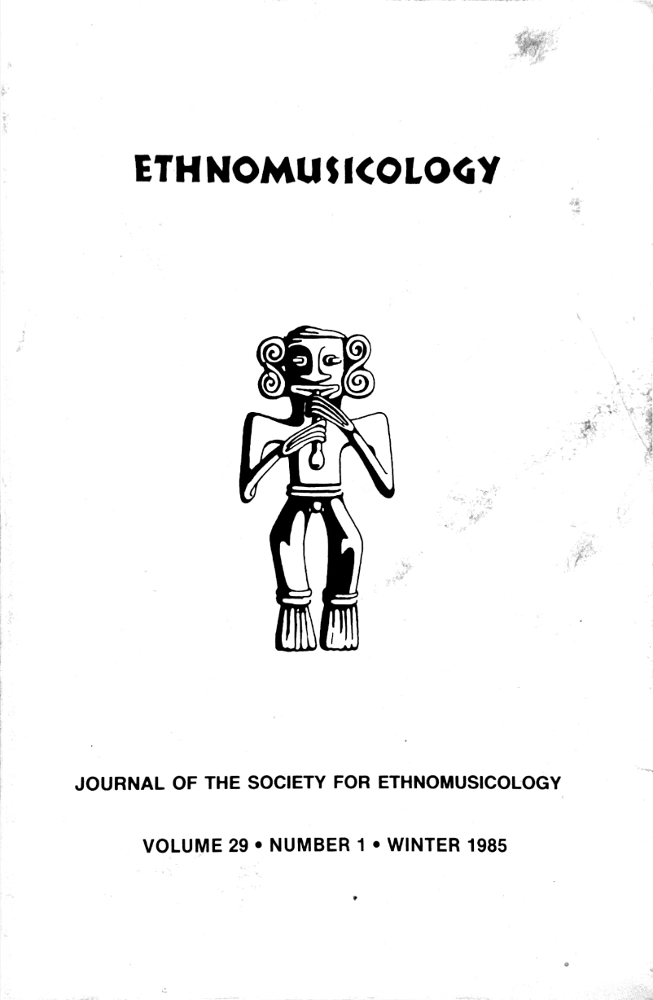
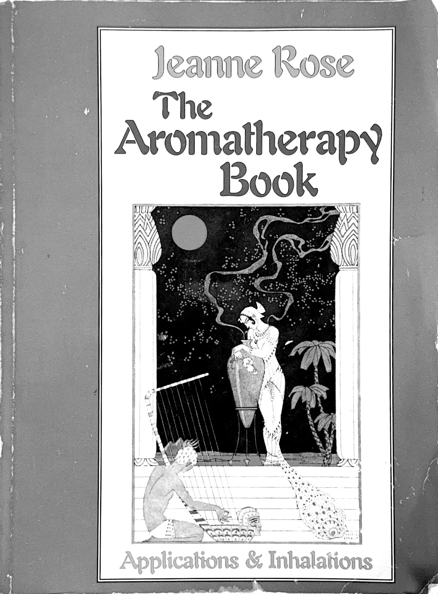
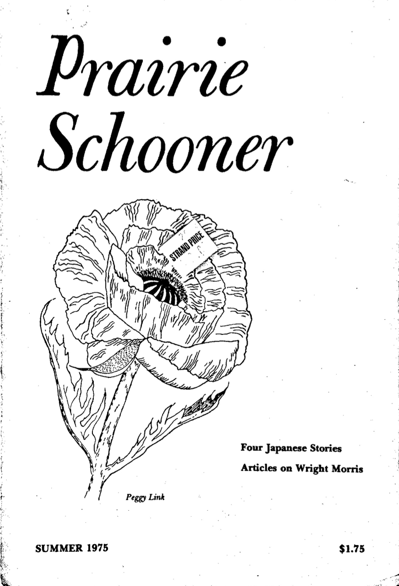
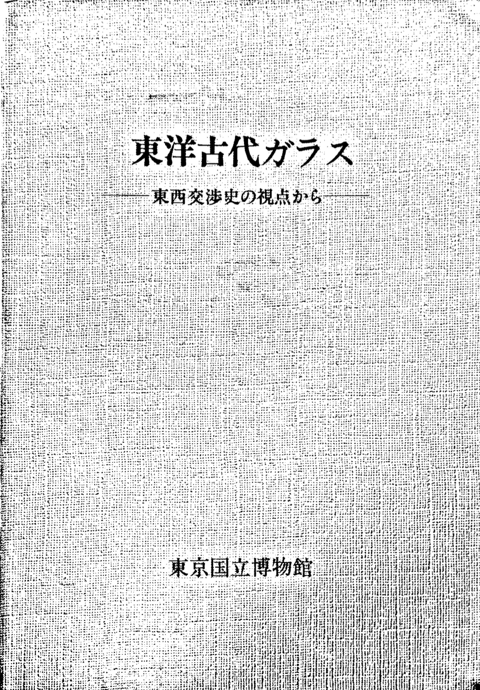

I was granted the opportunity to do some book buying for my dear friends at [Forecast](https://www.forecast.space) for a collaboration event between them and [Tekuno](https://teawithtekuno.com), a purveyor of tea and associated tea ritual objects.

The books were intended to serve as a thematic backdrop to the event itself, and feature subject matter that had to do with ritual, time passing, slowing down, and the onset of winter. To accompany the selection of books, I wrote a few quick/hasty/gestural blurbs about why these books were selected. 

Here are the unedited blurbs, which were refined/copyedited for the actual event, courtesy of [Tina](https://tinanguyen.com).

*The Secret of the Golden Flower*

I first encountered Richard Wilhelm’s work picking up a copy of the I-Ching in San Francisco’s legendary City Lights Bookstore. 

Wilhem’s translation of the I-Ching came packaged with a beautiful introduction which explained to the workaday Western “rationalist” mind that the *universal truth* the I-Ching claims to express has no grounding in a series of logical "rules" or "facts" about the world which are constructed by the human mind, and arguably representative of an artificial split in the probling/constructive rational mind, and the rest of the experienced-world.

Importantly, the universal truth contained in the I-Ching relates to the fact that the world "Is" regardless of our experience (Which also "Is" the world) of it, and the "method" of the I-Ching is in service towards this truth. Acknowledging the world view contained in the I-Ching is acknowledgement that a toss of a coin or yarrow stalk serves as a means of “binding” one’s current position in time and space, almost like wrapping up the universe in a tiny ephemeral bow.

The following reading of the I-Ching through Wilhelm’s eyes is an exercise in a person’s attempt to bridge cultures through the written word, acknowledging the necessary incompleteness of the task. You can only express so much through language, or the body, or a chance arrangement of coins.

This sentiment is expressed succinctly in one of the paragraphs in the conclusion of the book:

> The purpose of my commentary is to attempt to build a bridge of psychological understanding between East and West. The basis of every real understanding is man, and therefore I had to speak of human things.

Whenever flowers come up, I can’t help but recall a great passage in the Wikipedia entry for the Yaqui people (A people I share some lineage with):

> Flowers are very important in the Yaqui culture. According to Yaqui teachings, flowers sprang up from the drops of blood that were shed at the crucifixion. Flowers are viewed as the manifestation of souls. Occasionally Yaqui men may greet a close male friend with the phrase Haisa sewa? ("How is the flower?").\[19\]

*Field: Contemporary Poetry and Poetics, Number 1, Fall 1969*

I honestly love it when an old text calls to attention its being “contemporary”. I think some people worry too much about “dating” themselves. Some people are afraid to be perceived, and should realize that perception is something the body does. Perception is your body.

When I asked GPT4 about world historic events that happened in 1969, I was met with the following answer:

> The Apollo 12 mission, the sixth crewed mission in the Apollo program and the second to land on the Moon, launched on November 14, 1969. It contributed to space exploration and the broader context of the Space Race between the U.S. and the Soviet Union.

*Ethnomusicology: JOURNAL OF THE SOCIETY FOR ETHNOMUSICOLOGY, VOLUME 29 • NUMBER 1 • WINTER 1985*

I tell people pretty frequently these days that one of the “apex” expressions of human creativity is in the creation/formation/invention of musical instruments. I don’t really know how to express this feeling in an easy-to-summarize manner, but I feel it strongly.

This issue of Ethnomusicology details a variety of musical practices from around the world, the formation/cross-section of several musical instruments, and digs into the link between a culture and the music it produces.

Did you know you can use a vessel for drinking as a musical instrument?

*Ritual: Power, Healing, and Community*

This is an interesting one. If you flip over this book to the back and get a sense of the type of person it’s addressed to, I think it’s easy to write off this book as a crackpot tract intended to ensnare people into a cult of some sort.

The mailing slip states thus:

> The Swan and the Raven traditionally carry the Sacred Message between the Otherworld and our world. Swan • Raven & Company publishes books whose themes explore this Sacred Message.

Another book from this publisher is marketed as thus:

> Human Robots & Holy Mechanics
> Reclaiming Our Souls in a Machine World
> We are trapped in a mechanized consumer-driven society. The corporation-economy creates a Machine culture in which all of us are oilers of our spiritual impoverishment. We have been cut off from the Sacred — the connection with an Otherworld of spiritual reality that comes to us through Nature. Indigenous people and our archaic ancestors hold fundamental beliefs and ways of relating to the physical and non-physical world that we've lost in our society of the Machine. By initiating elder-leaders, establishing epiphanal communities, fasting from the media and mapping the topography of our inner experience, we begin to reclaim from the Machine the Sacred, and conceive a different future for ourselves, our children and our planet.

This book more or less details how the author’s encounter with death in his family facilitated a greater understand of his culture’s sensibilities around “ritual.” 

As a meta point, it’s worth mentioning that when you read a book, it doesn’t mean you immediately integrate it into your understanding of the world and “make it yours”. You can read anything you want and make of it what you will. Sometimes it’s worth reading a book to understand what someone who reads the same book and “makes it theirs” understands to be real. 

I often read books in this mode, not to directly understand the contents of the book per se, but to understand the orbiting world of ideas a book becomes integrated into and facilitates itself.

This book’s contents are interesting not because they are “about ritual” and contain a link to “the act of drinking tea and autumnal rituals”, it’s interesting because of everything else that orbits the act of death, everything that orbits family, everything that orbits food and drink, everything that orbits tea, and so on. Ritual exists in lifetimes and daytimes.

*The Aromatherapy Book: Applications and Inhalations*

A year ago or so in Miami, I was speaking to an acquaintance, describing a bottle of rare perfume I had in my possession that would probably be used up by year’s end. The idea of a rare scent, and commodity or entirely “free” scents is really interesting. My bottle of un-named perfume had to be present in the world somewhere, right? It’s crazy how I’ll never be lacking for the smell of cut grass or an unpeeled orange…

… My acquaintance happened to be a perfume-maker, and suggested that if I was okay with temporarily losing my bottle of perfume, he could make an attempt to re-synthesize the scent contained within, and possibly duplicate the perfume. I figured there would be no harm in trying and handed over the bottle, not knowing when I’d see it next…

~

The Aromatherapy Book: Applications and Inhalations drew me in with its evocative cover, a chapter describing various ways to eat and drink scents (including recipes for a tea, and a variety of snacks), and a variety of sexy quotes/excerpts on the power of scent. 

I don’t think I’m a pro or particularly obsessed purveyor of interesting smells, but I think it’s worth paying a little more attention to what you smell in the world. Last week in Lisbon, I learned that what you hear and see is pre-processed by parts of your brain designed to make “sense” of what’s seen or heard. 

Smell, on the other hand, is basically directly injected into the core of your cognition with no “pre-processing”. There’s no “making sense” of what you smell, you have as close to “direct interpretation” as you get, as far as senses are concerned. I didn’t do the due diligence to fact-check this information, but it’s worth reflecting on.

~

...I had totally forgotten about my bottle of rare perfume until a week ago, or a year since I first had the conversation with my perfume-designing acquaintance. I now have two bottles of this scent, and a hope that it won’t disappear anytime soon.

*Prairie Schooner, SUMMER 1975*

I spent a while reading a few poetry books this weekend, and a small excerpt from the Prairie Schooner (of Opticks, by Albert Goldbarth) is what cemented my desire to share it with you:

> ... Listen: even now we're singing
>
> hymns of glass in the glass cathedral: 
>
> canticles
>
> for the bestiary sucking the glass-bottom boat, 
>
> the zoom-lens grabbing us
>
> by our unsuspecting lapels, the visual geyser 
>
> up a microscope; it's ... listen:
>
> a song
> 
> I cannot imagine someone reading Opticks without coming to a new appreciation of glass. In this work Albert Goldbarth takes the "mute gos-pel" of glass and gives it tongue so eloquently that even after we have finished the poem the substance continues to preach to us.
> 
> A good poet draws us into his world; a great one alters our own.

This moment, written by Victor Constoski, brought to mind the intertextual themes I’m interested in highlighting – from tea vessels, to the material of glass, to the ritual facilitated by them.

*Ancient Glass from the Orient, Tokyo National Museum*

Most of this book is written in Japanese, and so I couldn’t read the majority of its contents without the aid of my phone: Scanning a page, translating it, scanning another, translating another, etc.

Curiously, there are several tracts printed in english, namely a “FOREWORD” addressed from the Tokyo National Museum describing the exhibition the catalogue describes, an essay near the end “ANCIENT GLASS FROM ORIENT”, by Sugiyama Jiro, and an english index near the end.

I’d argue that an exhibition catalogue doesn’t really ask its reader to “read” it per se. Curation is all about drawing lines around things that already exist. I don’t think you need to read in order to perceive a line drawn between things/ideas/concepts.

Besides the text content of this book, it’s simply a gorgeous example of functional typesetting and book layout. It contains some of the most sublime tables/diagrams I’ve seen in a long time.